# STAGE 0
  ## General
<!-- -------------------------------------------Git Basics---------------------------------------------------------------- -->

 
  

 0. Git Basics 

    

   
Screenshots:
 

  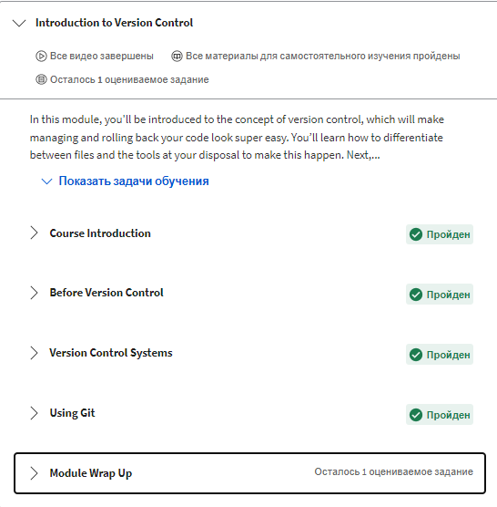
  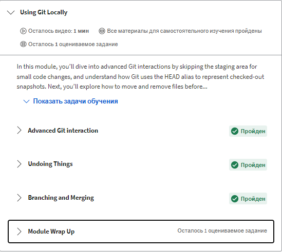
  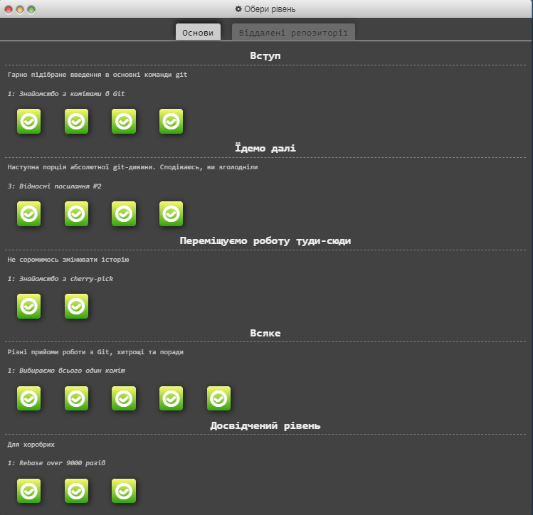
  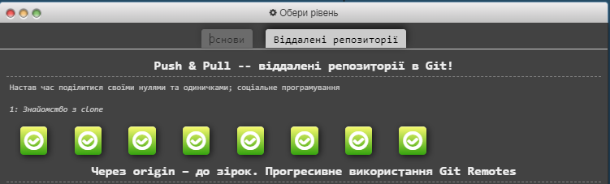

 

Summary:

#### I have never dealt with Git/Github before, the initial commands are quite understandable, but the juggling of commits and work with remote repositories are more complicated and require more time to understand, but I hope that with practice, my skills will become better.

#### In practice, everything turned out to be three times more complicated, especially when you solve conflicts through your irreverence, which as a result generates new conflicts, so it was a good lesson for me to recheck everything twice. Despite all the difficulties, I enjoyed working with Git and Github. 🙂

  
  

  
<!-- -----------------------------------------Linux CLI, and HTTP-------------------------------------------------------------- -->

 
  

 1. Linux CLI, and HTTP 

    

Screenshots:

)
)
)

Summary:

## Linux Survival (4 modules):
 #### In general, I was already familiar with the commands that were shown in the first 2 modules, but I did not use them often enough, so it was useful to practice them again. The commands, which were demonstrated in module 3/4 were new to me and I need more practice to use them comfortably.

#### I liked the visualization that was demonstrated in this resource, which allows you to better understand the result of each command. In the future, it will be useful to check it out again and refresh my knowledge.

## HTTP: The Protocol Every Web Developer Must Know (Part 1,2):
  
  #### A lot of new and already known to me theoretical material, which is unlikely to be 100% remains in your memory after reading, for better understanding I watched the additional videos and noted the main aspects. If it will be necessary in the future I will repeatedly return to the educational material and my notes as well.
  

   

<!-- -----------------------------------------Git Collaboration-------------------------------------------------------------- -->
  
 
    
 2. Git Collaboration 

    
  
 

Screenshots:

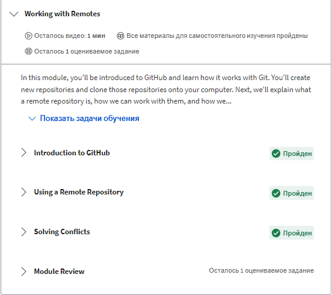
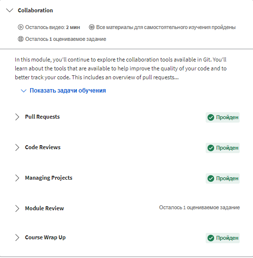
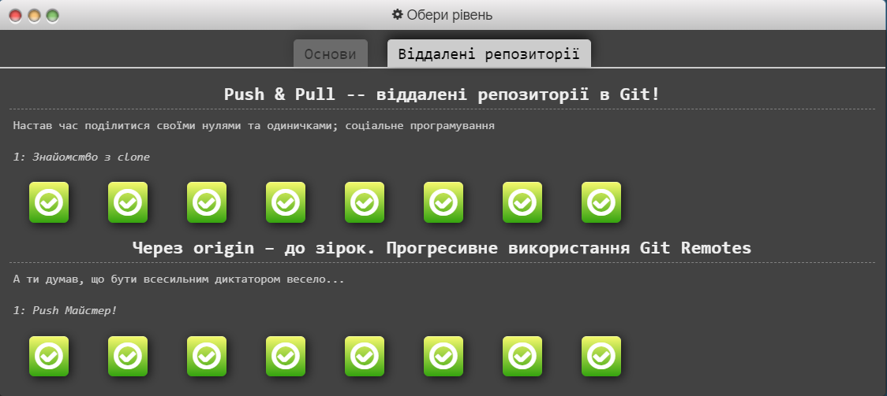
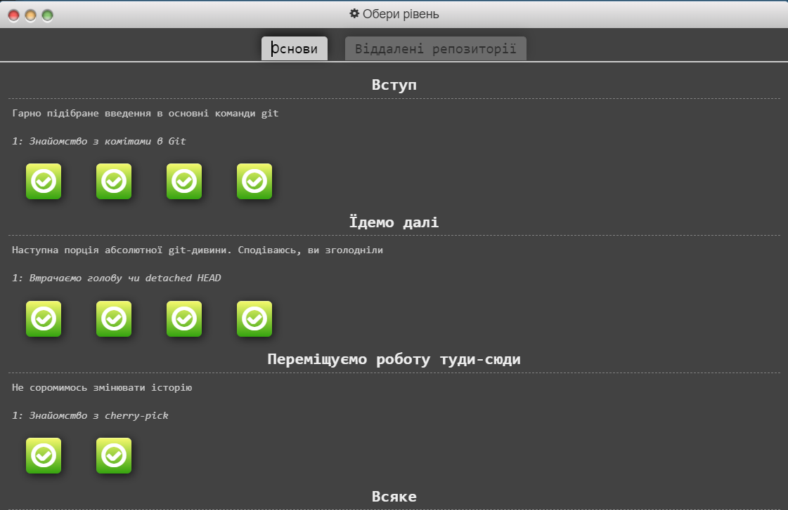

Summary:

#### 3/4 week was super informative, I have learned a lot of useful things. The "git rebase -i" very surprised me, it's really useful command, which allows you to do many things with the commits. In the future, I will repeatedly return to the educational material and my notes as well.

  
  

<!-- -----------------------------------------Front-End Basics-------------------------------------------------------------- -->

## Front-End Basics

 
    
 3. Intro to HTML & CSS 

     
    
  

Screenshots:

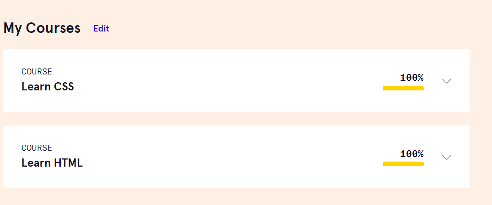
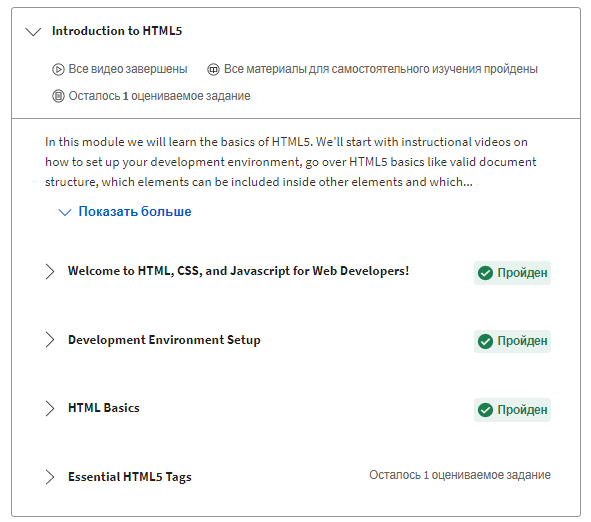
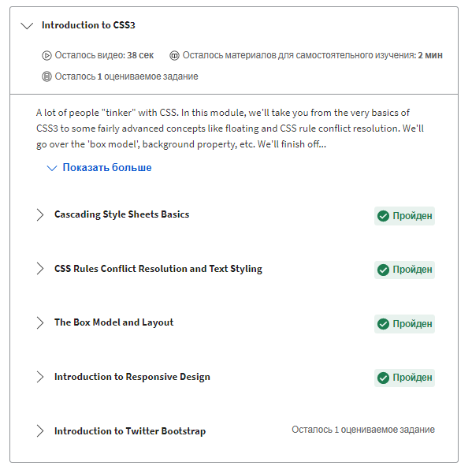
      

  
  

Summary:

#### I was already familiar with the 90% material that was presented, but the first time I have met with the Bootstrap Library. All in all, it was a perfect material to refresh my knowledge and learn some new stuff.

  
  

  <!-- -----------------------------------------Responsive Web Design-------------------------------------------------------------- -->
  

 
    
 4. Responsive Web Design 

     
    
  

Screenshots:

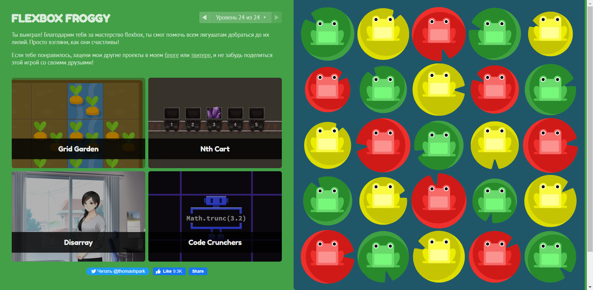
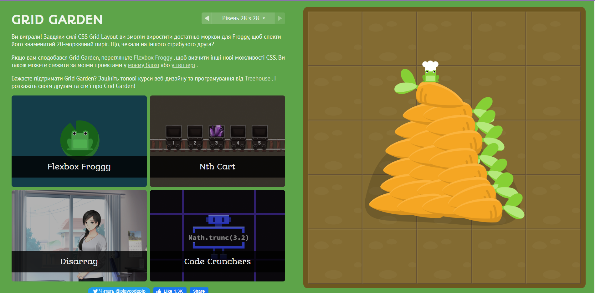
      

  
  

Summary:

#### Previously, I was already familiar with Flexbox/Grid thanks to this YouTube channel, I like his clear explanation with practical examples, by the way, I often use his Flexbox/Grid cheat sheets. It was helpful for me to review this material again. Also on his channel, there is a good explanation about responsive web design. 

#### Very cool games, they are a great addition to learning the Flexbox/Grid. I happily would return to them to refresh my knowledge.

  
  

    <!-- -----------------------------------------HTML & CSS Practice-------------------------------------------------------------- -->
  
  
  
  
  
