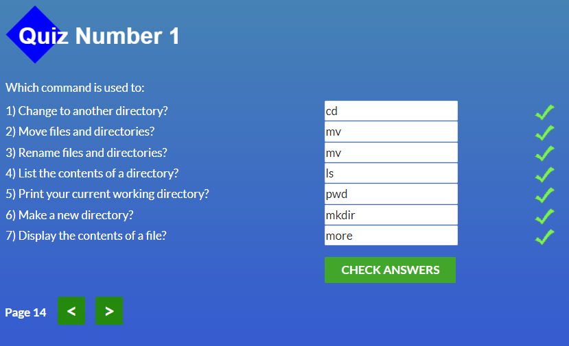
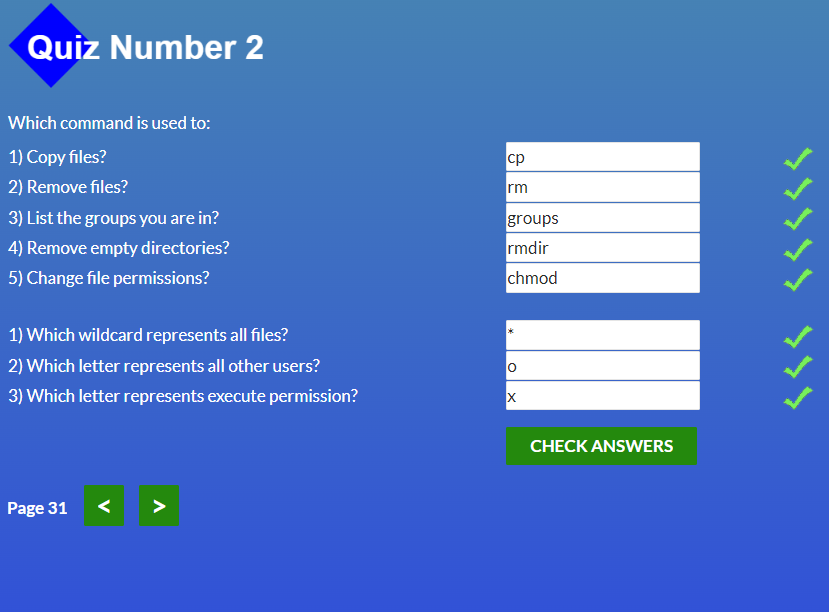
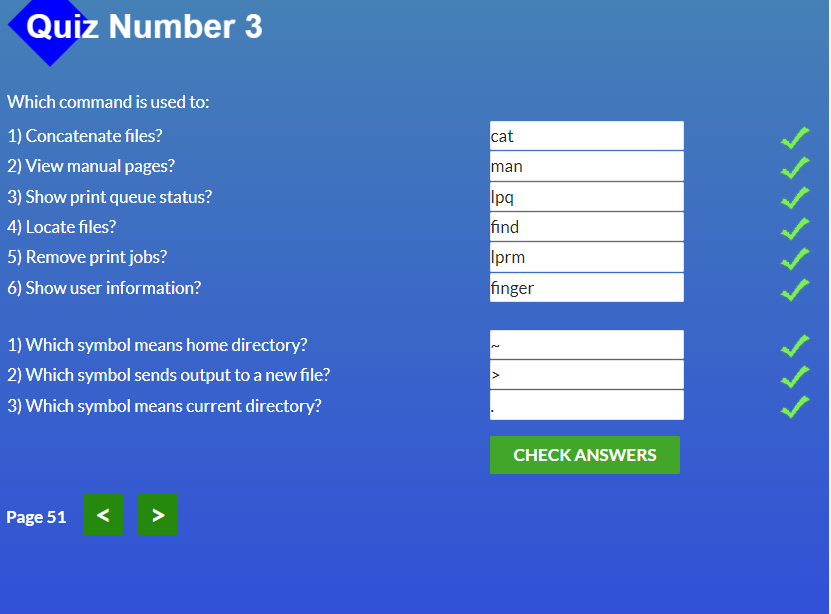
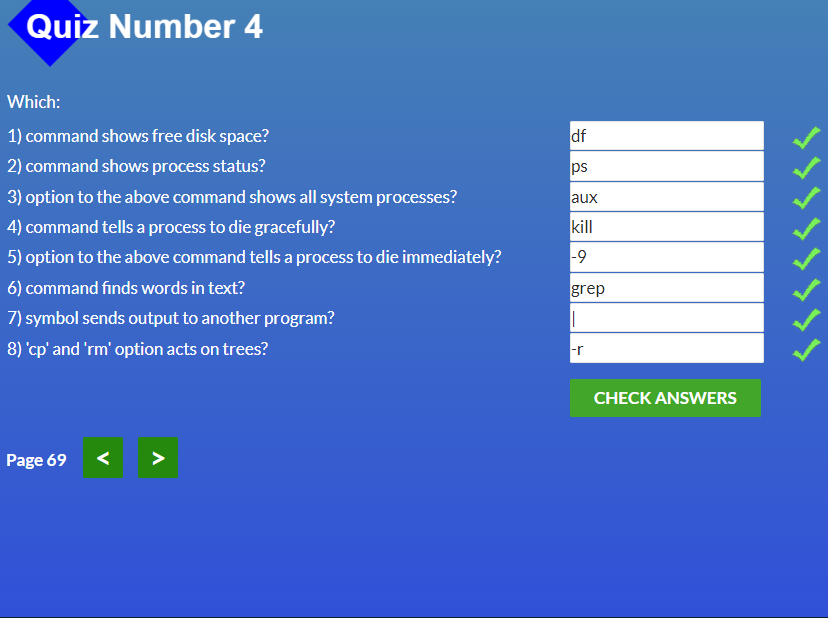

## Git Basics

Основи:

Віддалені репозиторії:

Враження:

### До цього ніколи не доводилося мати справи із Git/Github, початкові команди цілком зрозумілі, а ось жонглювання комітами та робота із віддаленими репозиторіями, як на мене - є більш складними та потребують більше часу для зрозуміння, сподіваюсь із практикою розуміння й рівень моїх вмінь дійде до автоматизму.

### Не зважаючи на всі складнощі мені сподобалося працювати із новими для себе технологіями 🙂

 

## Linux CLI, and HTTP

Quiz1

Quiz2

)

Quiz3

)

Quiz4

)

Враження:

## 1. Linux Survival (4 modules):
#### В загальному я вже був ознайомлений із командами, що були перераховані у перших 2 модулях але не використовував їх досить часто, тому було корисно пригадати та використати їх на практиці знову.

#### Команди, що були продемонстровані у модулі 3/4 були для мене новими, тому потребують більше практики для того, щоб комфортно їх використовувати.

#### Сподобалася візуалізація, що була продемонстрована у цьому ресурсі, яка дозволяє краще розуміти хід виконання тієї чи іншої команди. В майбутньому, коли доведеться працювати із Linux буде корисним зазирнути туди знову й освіжити свої знання.
